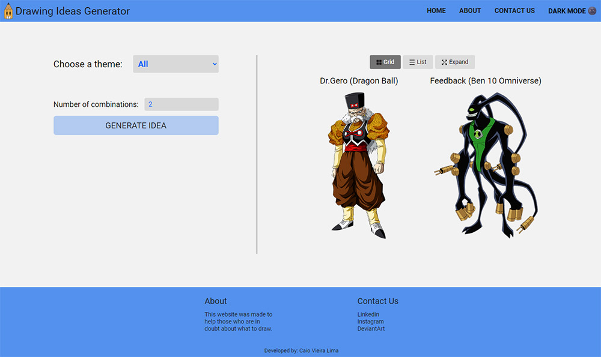
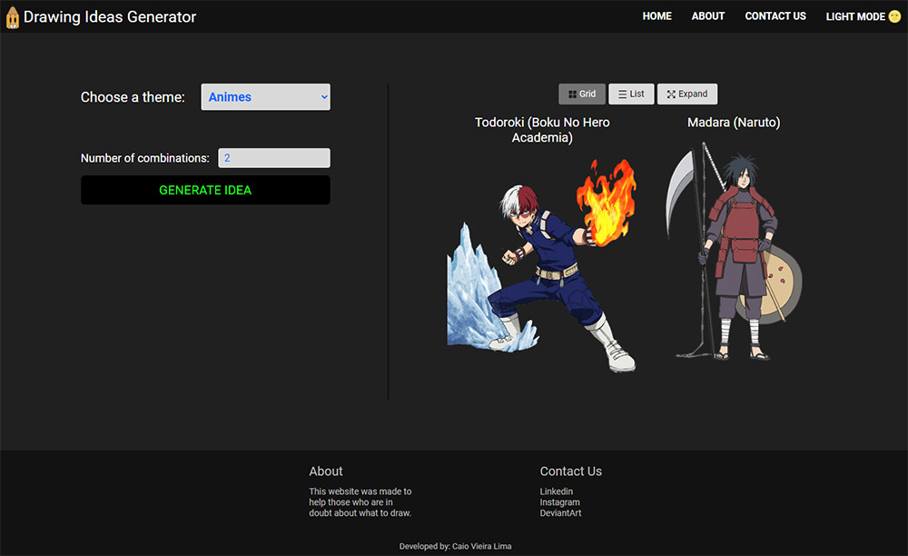

# Drawing Ideas Generator 

This website was made to help those who are in doubt about what to draw!

 

## Table of contents

- [Home](#home)
    - [Light Mode](#light-mode)
    - [Dark Mode](#dark-mode)
- [Author](#author)

 

***

 

## Home

- ### Light Mode

 

- ### Dark Mode

 
 

## Author

- [Caio Vieira de Castro Lima](https://www.linkedin.com/in/caiovieiralima/)