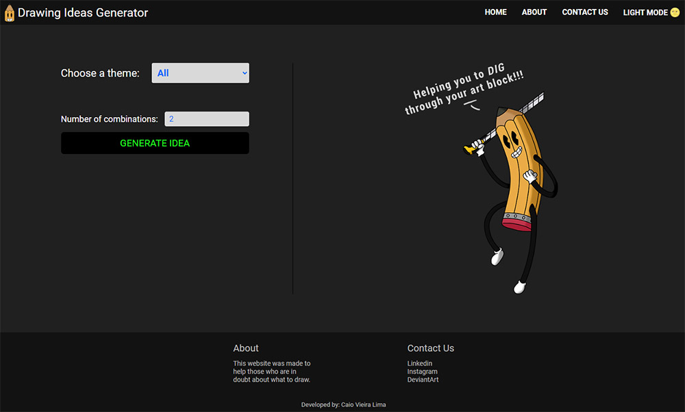

# Drawing Ideas Generator 

This website was made to help those who are in doubt about what to draw!

 

## Table of contents

- [About](#about)
    - [How it works](#how-it-works)
    - [What user can do](#what-users-can-do)

- [Screenshots](#screenshots)
    - [Desktop](#desktop)
        - [Light Mode](#dLightMode)
        - [Dark Mode](#dDarkMode)

    - [Mobile](#mobile)
        - [Light Mode](#mLightMode)
        - [Dark Mode](#mDarkMode)

- [Used APIs](#used-apis)

- [Author](#author)

 

***

 

## About

### How it works

 - The ideas come from two sources: themes.json (which is hosted on firebase, acting as a Fake Api) and extertnal APIs (like Poke Api). Through Javascript, all APIs are consumed using the fetch method and rendered on the screen, every time the "Generate Idea" button is pressed.

 Ps.: themes.json stores themes previously selected by me.

 

### What users can do

 -> Choose the theme (although the default theme is "all themes")

 -> Change the number of generated ideas.

 -> Choose to see ideas as "grid" or "list"

 -> Change from light to dark mode, and vice versa.

 -> Change zoom level. (In Firefox this function is disabled, as this browser does not support the "zoom" property)

 
 

## Screenshots

### Desktop

- #### 
Light Mode

 

- #### 
Dark Mode

 

### Mobile

- #### 
Light Mode

 

- #### 
Dark Mode

 
 

## Used APIs 

[Poke Api](https://pokeapi.co/) 
[Pokémon Assets](https://github.com/HybridShivam/Pokemon)

 
 

## Link

<a href = "https://drawingideasgenerator.netlify.app/" target="_blank">Link</a>

 
 

## Author

- [Caio Vieira de Castro Lima](https://www.linkedin.com/in/caiovieiralima/)