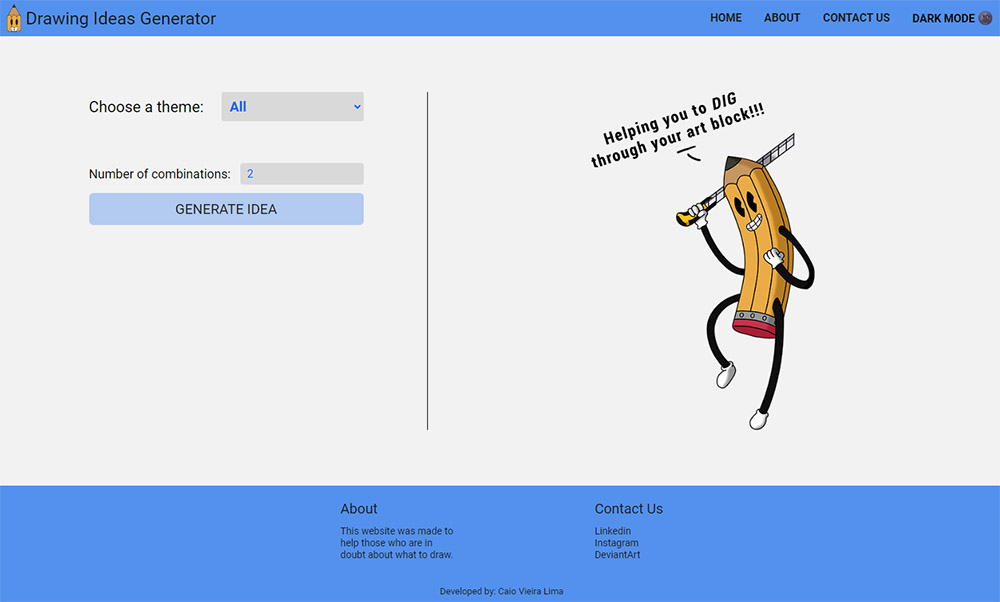

# Drawing Ideas Generator 

This website was made to help those who are in doubt about what to draw!

 

## Table of contents

- [Desktop](#desktop)
    - [Light Mode](#dLightMode)
    - [Dark Mode](#dDarkMode)

- [Mobile](#mobile)
    - [Light Mode](#mLightMode)
    - [Dark Mode](#mDarkMode)

- [Author](#author)

 

***

 

## Desktop

- ### 
Light Mode

 

- ### 
Dark Mode

 

## Mobile

- ### 
Light Mode

 

- ### 
Dark Mode

 
 

## Author

- [Caio Vieira de Castro Lima](https://www.linkedin.com/in/caiovieiralima/)