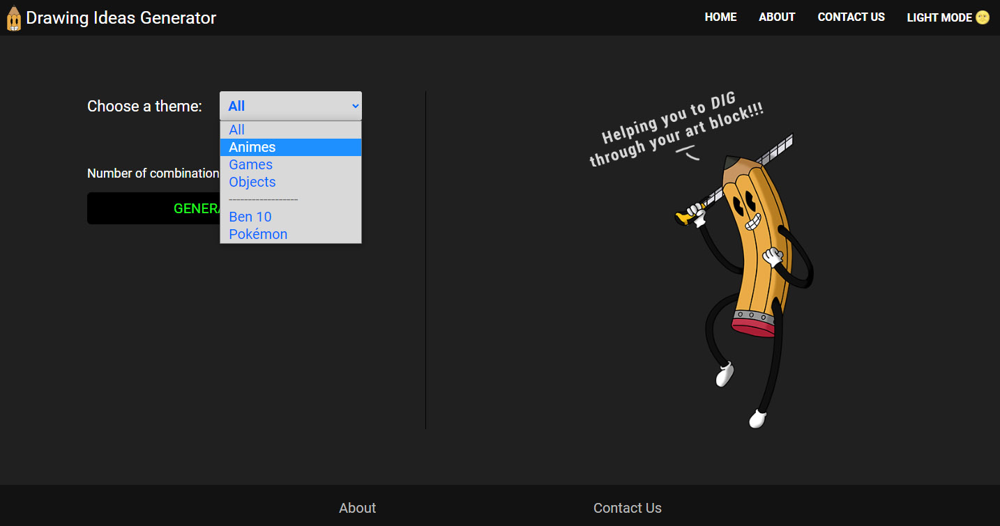

# Drawing Ideas Generator 

This website was made to help those who are in doubt about what to draw!

 

## Table of contents

- [About](#about)
    - [How it works](#how-it-works)
    - [What user can do](#what-users-can-do)

- [Screenshots](#screenshots)
    - [Desktop](#desktop)
        - [Light Mode](#dLightMode)
        - [Dark Mode](#dDarkMode)

    - [Mobile](#mobile)
        - [Light Mode](#mLightMode)
        - [Dark Mode](#mDarkMode)

- [Author](#author)

 

***

 

## About

### How it works

 - All ideas are stored in a .json, which is hosted on firebase (acting as a Fake Api). Through Javascript, this .json is consumed using the fetch method and rendered on screen, every time the "generate idea" button is pressed.

### What users can do

 -> Choose the theme (although the default theme is "all themes")

 -> Change the number of generated ideas.

 -> Choose to see ideas as "grid" or "list"

 -> Change from light to dark mode, and vice versa.

 

## Screenshots

### Desktop

- #### 
Light Mode

 

- #### 
Dark Mode

 

### Mobile

- #### 
Light Mode

 

- #### 
Dark Mode

 
 

## Link

<a href = "https://drawingideasgenerator.netlify.app/" target="_blank">Link</a>

 
 

## Author

- [Caio Vieira de Castro Lima](https://www.linkedin.com/in/caiovieiralima/)